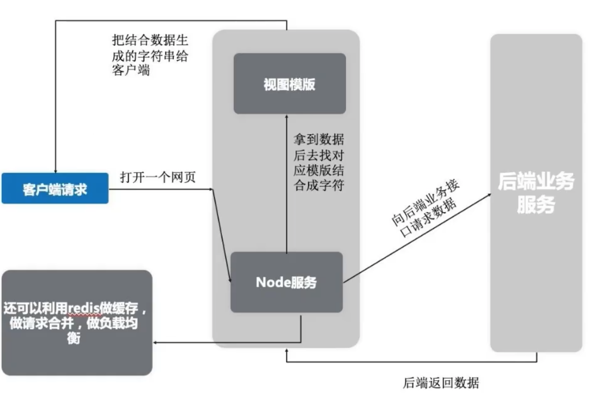

# Node.js

## 介绍

基于Google V8引擎的JavaScript运行时环境，同时结合Libuv扩展了JavaScript功能，使之成为io、fs等只有语言才有的特性。同时拥有DOM操作和I/O、文件读写、操作数据库（服务器端）等能力。

### 特点：

事件驱动、非阻塞IO模型（异步）、轻量和高效。



### 使用：

1. 做中间层
   1). 减轻客户端内存，不会像mvvm模式的项目把页面渲染和数据请求都压在客户端，而是在服务端完成。
   2). SEO性能好，服务端渲染好html字符，有利于网页被搜索到。
   3). 前端可操控范围增多，甚至可以做服务器，

2. 做项目构建工具
   webpack、vue-cli都是输入项目构建工具，通过node来写的。

3. 做小型网站后端

## 模块化

### 模块化的好处

​	低耦合、高内聚：提高重复利用率
​	方便维护：模块化便于管理
​	防止代码重复：通过必报的形式来保护变量不收外界干扰。

### CommonJS

Node.js基于CommonJS实现原理是文件的读写，使用exports、require、module

#### require

```js
// require node和es6都支持的引入
let a = require('./test.js')

//第三方包名则优先在同级目录的node_modules下查找第三方包
let template = require('art-template')
// 通过第三方包中的package.json文件找到里面的main属性对应的入口模块，该入口模块即为加载的第三方模块
//若没有找到node_modules文件夹，或者上述情况都没有找到，则会向上一级目录查找node_modules
//如果到该模块根路径都没有找到，则会报错：
//can not find module xxx
```

#### exports和module.exports

在node执行文件时，会给文件生成exports和module对象，而module又有一个exports属性，都指向同一块内存区域。


```js
// exports = module.exports = {};
// exports只有es6支持的导出 module.exports只有node支持的导出
exports.test = function() {
  console.log("test")
}

//utils.js
let a = 100;
console.log(module.exports); //能打印出结果为：{}
console.log(exports); //能打印出结果为：{}
exports.a = 200; //这里辛苦劳作帮 module.exports 的内容给改成 {a : 200}
exports = '指向其他内存区'; //这里把exports的指向指走
//test.js
var a = require('/utils');
console.log(a) // 打印为 {a : 200}
```

#### export和export default

1. export和export default均可用于导出常量、函数、文件、模块等。
2. export、import可以有多个，export default**只能有一个**
3. 通过export方式导出，**导入时要加 { }** ，export default不需要
4. export可以**直接导出变量表达式**，export default不行。

```js
//testEs6Export.js
//导出变量
export const a = '100';
//导出函数方式1
export const test1 = function() {
  //....
}
//导出函数方式2
function test2() {
  //....
};
export { test2 }; //或者也可以使用exports.test2 = test2
// 不可以使用export default const b = 100
const b = 100;
export default b;

//main.js
import { test, test2 } from './testEs6Export' //导出export
import b from './testEs6Export' //导出export default
//通过as集合导出对象
import * as testModule from './testEs6Export'
//! 注意default是导出为default属性，as仅是通过聚合export成一个对象。
testModule.b //undefined
testModule.default //100
```

### NPM

npm：node package manager

```js
//基本操作
npm init //初始化package.json文件
npm install //下载package.json中所有依赖
npm install xxx --save-dev //仅用于开发环境，出现在devDependencies属性中
npm isntall xxx --save //用于生产环境，出现在dependencies属性中
npm list //已安装的node包
npm info xxx //查看远程npm上指定包的所有版本信息
npm root //查看当前包的安装路径
npm root -g //查看全局的包的安装路径
npm ls xx //查看本地包及版本信息
npm ls xx -g
```

## FS 文件系统

### 读取文件

```js
const fs= require('fs')

//同步读取
var data = fs.readFileSync('hello.txt');
//异步读取
fs.readFile('hello.txt',function(err, data){
  if(err) throw err;
  console.log(data);
})
fs.writeFile('test.txt','helloworld',{flag:'a', encoding:'utf-8'}, function(err){
  if(err) console.log("error",err)
})
```

### 打开文件

```js
// fs.open(path, flags[, mode], callback)
fs.open('input.txt', 'r+', function(err, fd) {
  if(err) {
    return console.error(err);
  }
  console.log("打开成功！")
});
```

- **path** - 文件的路径。
- **flags** - 文件打开的行为。具体值详见下文。
- **mode** - 设置文件模式(权限)，文件创建默认权限为 0666(可读，可写)。
- **callback** - 回调函数，带有两个参数如：callback(err, fd)。

| Flag | 描述                                                   |
| ---- | ------------------------------------------------------ |
| r    | 以读取模式打开文件。如果文件不存在抛出异常。           |
| r+   | 以读写模式打开文件。如果文件不存在抛出异常。           |
| rs   | 以同步的方式读取文件。                                 |
| rs+  | 以同步的方式读取和写入文件。                           |
| w    | 以写入模式打开文件，如果文件不存在则创建。             |
| wx   | 类似 'w'，但是如果文件路径存在，则文件写入失败。       |
| w+   | 以读写模式打开文件，如果文件不存在则创建。             |
| wx+  | 类似 'w+'， 但是如果文件路径存在，则文件读写失败。     |
| a    | 以追加模式打开文件，如果文件不存在则创建。             |
| ax   | 类似 'a'， 但是如果文件路径存在，则文件追加失败。      |
| a+   | 以读取追加模式打开文件，如果文件不存在则创建。         |
| ax+  | 类似 'a+'， 但是如果文件路径存在，则文件读取追加失败。 |


### 获取文件信息

```js
// fs.stat(path, callback)
fs.stat('test.js', function(err, stats) {
  console.log(stats.isFile());
})
```

states类中方法有：

| 方法                      | 描述                                                         |
| ------------------------- | ------------------------------------------------------------ |
| stats.isFile()            | 如果是文件返回 true，否则返回 false。                        |
| stats.isDirectory()       | 如果是目录返回 true，否则返回 false。                        |
| stats.isBlockDevice()     | 如果是块设备返回 true，否则返回 false。                      |
| stats.isCharacterDevice() | 如果是字符设备返回 true，否则返回 false。                    |
| stats.isSymbolicLink()    | 如果是软链接返回 true，否则返回 false。                      |
| stats.isFIFO()            | 如果是FIFO，返回true，否则返回 false。FIFO是UNIX中的一种特殊类型的命令管道。 |
| stats.isSocket()          | 如果是 Socket 返回 true，否则返回 false。                    |

### 写入文件

```js
// fs.writeFile(file, data[, options], callback)
fs.writeFile('input.txt', '我是通过fs.writeFile 写入文件的内容',  function(err) {
   if (err) {
       return console.error(err);
   }
   fs.readFile('input.txt', function (err, data) {
      if (err) {
         return console.error(err);
      }
      console.log("异步读取文件数据: " + data.toString());
   });
});
```

- **file** - 文件名或文件描述符。
- **data** - 要写入文件的数据，可以是 String(字符串) 或 Buffer(缓冲) 对象。
- **options** - 该参数是一个对象，包含 {encoding, mode, flag}。默认编码为 utf8, 模式为 0666 ， flag 为 'w'
- **callback** - 回调函数，回调函数只包含错误信息参数(err)，在写入失败时返回。

### 读取文件

```js
// fs.read(fd, buffer, offset, length, position, callback)
```

- **fd** - 通过 fs.open() 方法返回的文件描述符。
- **buffer** - 数据写入的缓冲区。
- **offset** - 缓冲区写入的写入偏移量。
- **length** - 要从文件中读取的字节数。
- **position** - 文件读取的起始位置，如果 position 的值为 null，则会从当前文件指针的位置读取。
- **callback** - 回调函数，有三个参数err, bytesRead, buffer，err 为错误信息， bytesRead 表示读取的字节数，buffer 为缓冲区对象。

### 关闭文件

```js
// fs.close(fd, callback)
var fs = require("fs");
var buf = new Buffer.alloc(1024);
fs.open('input.txt', 'r+', function(err, fd) {
   if (err) {
       return console.error(err);
   }
   fs.read(fd, buf, 0, buf.length, 0, function(err, bytes){
      if (err){
         console.log(err);
      }
      // 仅输出读取的字节
      if(bytes > 0){
         console.log(buf.slice(0, bytes).toString());
      }
      // 关闭文件
      fs.close(fd, function(err){
         if (err){
            console.log(err);
         } 
         console.log("文件关闭成功");
      });
   });
});
```

- **fd** - 通过 fs.open() 方法返回的文件描述符。
- **callback** - 回调函数，没有参数。

### 截取文件

```js
// fs.ftruncate(fd, len, callback)
fs.ftruncate(fd, 10, function(err){
  if (err){
    console.log(err);
  } 
});
```

- **fd** - 通过 fs.open() 方法返回的文件描述符。
- **len** - 文件内容截取的长度。
- **callback** - 回调函数，没有参数。

### 删除文件

```js
// fs.unlink(path, callback)
fs.unlink('input.txt', function(err) {
   if (err) {
       return console.error(err);
   }
   console.log("文件删除成功！");
});
```

### 创建目录

```js
// fs.mkdir(path[, options], callback)
fs.mkdir("/tmp/test/",function(err){
   if (err) {
       return console.error(err);
   }
   console.log("目录创建成功。");
});
```

- **path** - 文件路径。
- options 参数可以是：
  - **recursive** - 是否以递归的方式创建目录，默认为 false。
  - **mode** - 设置目录权限，默认为 0777。
- **callback** - 回调函数，没有参数。

### 读取目录

```js
// fs.readdir(path, callback)
fs.readdir("/tmp/",function(err, files){
   if (err) {
       return console.error(err);
   }
   files.forEach( function (file){
       console.log( file );
   });
});
```

- **path** - 文件路径。
- **callback** - 回调函数，回调函数带有两个参数err, files，err 为错误信息，files 为 目录下的文件数组列表。

### 删除目录

```js
// fs.rmdir(path, callback)
fs.rmdir("/tmp/test",function(err){
   if (err) {
       return console.error(err);
   }
});
```

## Stream 流

Node.js有四种流类型：

- Readable - 可读操作
- Writeable - 可写操作
- Duplex - 可读可写操作
- Transform - 操作被写入数据，然后读出结果。

所有的Stream对象都是EventEmitter的实例，常用的事件有：

- data：当有数据可读时触发
- end：没有更多的数据可读时触发
- error：在接收和写入过程中发生错误时触发
- finish：所有数据已被写入到底层系统时触发

### 从流中读取数据

```js
var fs = require("fs");
var data = '';
// 创建可读流
var readerStream = fs.createReadStream('input.txt');
// 设置编码为 utf8。
readerStream.setEncoding('UTF8');
// 处理流事件 --> data, end, and error
readerStream.on('data', function(chunk) {
   data += chunk;
});
readerStream.on('end',function(){
   console.log(data);
});
readerStream.on('error', function(err){
   console.log(err.stack);
});
console.log("程序执行完毕");
```

### 写入流

```js
var fs = require("fs");
var data = 'hello world this is test';
// 创建一个可以写入的流，写入到文件 output.txt 中
var writerStream = fs.createWriteStream('output.txt');
// 使用 utf8 编码写入数据
writerStream.write(data,'UTF8');
// 标记文件末尾
writerStream.end();
// 处理流事件 --> finish、error
writerStream.on('finish', function() {
    console.log("写入完成。");
});
writerStream.on('error', function(err){
   console.log(err.stack);
});
console.log("程序执行完毕");
```

### 管道流

管道提供了一个输出流到输入流的机制。通常我们用于从一个流中获取数据并将数据传递到另外一个流中。

```js
var fs = require("fs");
// 创建一个可读流
var readerStream = fs.createReadStream('input.txt');
// 创建一个可写流
var writerStream = fs.createWriteStream('output.txt');
// 管道读写操作
// 读取 input.txt 文件内容，并将内容写入到 output.txt 文件中
readerStream.pipe(writerStream);
console.log("程序执行完毕");
```

#### 链式流

链式是通过连接输出流到另外一个流并创建多个流操作链的机制。链式流一般用于管道操作。

```js
//链式写入
var fs = require("fs");
var zlib = require('zlib');
// 压缩 input.txt 文件为 input.txt.gz
fs.createReadStream('input.txt')
  .pipe(zlib.createGzip())
  .pipe(fs.createWriteStream('input.txt.gz'));
console.log("文件压缩完成。");

//链式输出
var fs = require("fs");
var zlib = require('zlib');
// 解压 input.txt.gz 文件为 input.txt
fs.createReadStream('input.txt.gz')
  .pipe(zlib.createGunzip())
  .pipe(fs.createWriteStream('input.txt'));
console.log("文件解压完成。");
```

## Events 事件
