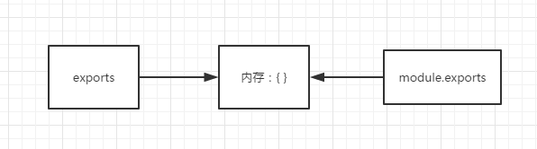

# Node.js

## 介绍

基于Google V8引擎的JavaScript运行时环境，同时结合Libuv扩展了JavaScript功能，使之成为io、fs等只有语言才有的特性。同时拥有DOM操作和I/O、文件读写、操作数据库（服务器端）等能力。

### 特点：

事件驱动、非阻塞IO模型（异步）、轻量和高效。


### 使用：

1. 做中间层
   1). 减轻客户端内存，不会像mvvm模式的项目把页面渲染和数据请求都压在客户端，而是在服务端完成。
   2). SEO性能好，服务端渲染好html字符，有利于网页被搜索到。
   3). 前端可操控范围增多，甚至可以做服务器，

2. 做项目构建工具
   webpack、vue-cli都是输入项目构建工具，通过node来写的。

3. 做小型网站后端

## 模块化

### 模块化的好处

​	低耦合、高内聚：提高重复利用率
​	方便维护：模块化便于管理
​	防止代码重复：通过必报的形式来保护变量不收外界干扰。

### CommonJS

Node.js基于CommonJS实现原理是文件的读写，使用exports、require、module

#### require

```js
// require node和es6都支持的引入
let a = require('./test.js')

//第三方包名则优先在同级目录的node_modules下查找第三方包
let template = require('art-template')
// 通过第三方包中的package.json文件找到里面的main属性对应的入口模块，该入口模块即为加载的第三方模块
//若没有找到node_modules文件夹，或者上述情况都没有找到，则会向上一级目录查找node_modules
//如果到该模块根路径都没有找到，则会报错：
//can not find module xxx
```

#### exports和module.exports

在node执行文件时，会给文件生成exports和module对象，而module又有一个exports属性，都指向同一块内存区域。



```js
// exports = module.exports = {};
// exports只有es6支持的导出 module.exports只有node支持的导出
exports.test = function() {
  console.log("test")
}

//utils.js
let a = 100;
console.log(module.exports); //能打印出结果为：{}
console.log(exports); //能打印出结果为：{}
exports.a = 200; //这里辛苦劳作帮 module.exports 的内容给改成 {a : 200}
exports = '指向其他内存区'; //这里把exports的指向指走
//test.js
var a = require('/utils');
console.log(a) // 打印为 {a : 200}
```

#### export和export default

1. export和export default均可用于导出常量、函数、文件、模块等。
2. export、import可以有多个，export default**只能有一个**
3. 通过export方式导出，**导入时要加 { }** ，export default不需要
4. export可以**直接导出变量表达式**，export default不行。

```js
//testEs6Export.js
//导出变量
export const a = '100';
//导出函数方式1
export const test1 = function() {
  //....
}
//导出函数方式2
function test2() {
  //....
};
export { test2 }; //或者也可以使用exports.test2 = test2
// 不可以使用export default const b = 100
const b = 100;
export default b;

//main.js
import { test, test2 } from './testEs6Export' //导出export
import b from './testEs6Export' //导出export default
//通过as集合导出对象
import * as testModule from './testEs6Export'
//! 注意default是导出为default属性，as仅是通过聚合export成一个对象。
testModule.b //undefined
testModule.default //100
```

### NPM

npm：node package manager

```js
//基本操作
npm init //初始化package.json文件
npm install //下载package.json中所有依赖
npm install xxx --save-dev //仅用于开发环境，出现在devDependencies属性中
npm isntall xxx --save //用于生产环境，出现在dependencies属性中
npm list //已安装的node包
npm info xxx //查看远程npm上指定包的所有版本信息
npm root //查看当前包的安装路径
npm root -g //查看全局的包的安装路径
npm ls xx //查看本地包及版本信息
npm ls xx -g
```

#### npm版本符号

^：锁定major
~：锁定minor
空：锁定patch
*：最新版本

## 内置工具模块

### Querystring 字符串转换

```js
const querystring = require('querystring')
// parse
var qs = 'x=3&y=4'
var parsed = querystring.parse(qs)
console.log(parsed)

// stringfy 和parse相反
const querystring = require('querystring')
var qo = {
  x: 3,
  y: 4
}
var parsed = querystring.stringify(qo)
console.log(parsed)

//escape/unescape
const querystring = require('querystring')
var str = 'id=3&city=北京&url=https://www.baidu.com'
var escaped = querystring.escape(str)
console.log(escaped)

const querystring = require('querystring')
var str = 'id%3D3%26city%3D%E5%8C%97%E4%BA%AC%26url%3Dhttps%3A%2F%2Fwww.baidu.com'
var unescaped = querystring.unescape(str)
console.log(unescaped)
```


### Path 路径

```js
let path = require('path');

// 获取后缀名，即最后一个'.'之后的部分
let strPath = "http://www.test.com/a.jpg";
let info = path.extname( strPath ); //.jpg

//解析为绝对路径
path.resolve('/nodejs','study','modules'); // C:\nodejs\study\modules

//规范化路径
path.normalize(p)

//判断是否是绝对路径
path.isAbsolute(p)

//绝对路径转化为相对路径，从from到to path.relative(from,to)
path.relative('data/test/aaa','data/impl/bbb') // 返回 '../../impl/bbb'

//返回路径中代表文件夹的部分
path.dirname(p)

//返回路径中的最后一部分
path.basename(p[,ext])

//返回路径字符串对象
path.parse(pathString)

//从对象中返回路径字符串，和path.parse相反
path.format(pathObject)

//获取路径和脚本名
console.log(__filename) //执行文件的文件路径，为绝对路径
console.log(__dirname) //当前执行脚本所在的目录
process.cwd() //当前执行node命令时候的文件夹目录名
```

### OS 操作系统

| 序号 | 方法 & 描述                                                  |
| ---- | ------------------------------------------------------------ |
| 1    | **os.tmpdir()** 返回操作系统的默认临时文件夹。               |
| 2    | **os.endianness()** 返回 CPU 的字节序，可能的是 "BE" 或 "LE"。 |
| 3    | **os.hostname()** 返回操作系统的主机名。                     |
| 4    | **os.type()** 返回操作系统名                                 |
| 5    | **os.platform()** 返回编译时的操作系统名                     |
| 6    | **os.arch()** 返回操作系统 CPU 架构，可能的值有 "x64"、"arm" 和 "ia32"。 |
| 7    | **os.release()** 返回操作系统的发行版本。                    |
| 8    | **os.uptime()** 返回操作系统运行的时间，以秒为单位。         |
| 9    | **os.loadavg()** 返回一个包含 1、5、15 分钟平均负载的数组。  |
| 10   | **os.totalmem()** 返回系统内存总量，单位为字节。             |
| 11   | **os.freemem()** 返回操作系统空闲内存量，单位是字节。        |
| 12   | **os.cpus()** 返回一个对象数组，包含所安装的每个 CPU/内核的信息：型号、速度（单位 MHz）、时间（一个包含 user、nice、sys、idle 和 irq 所使用 CPU/内核毫秒数的对象）。 |
| 13   | **os.networkInterfaces()** 获得网络接口列表。                |

### HTTP/HTTPS 网络

#### node的浏览器端调试

```shell
node --inspect --inspect-brk server.js
#可利用进程管理工具
nodemon server.js
```

#### node进程管理工具

supervisor
nodemon
forever
pm2

#### GET

```js
const http = require('http')
const querystring = require('querystring')
const https = require('https')

const server = http.createServer((request, response) => {
  var url = request.url.substr(1)
  var data = ''
  response.writeHeader(200, {
    'content-type': 'application/json;charset=utf-8',
    'Access-Control-Allow-Origin': '*'
  })
  https.get(`https://m.lagou.com/listmore.json${url}`, (res) => {
    res.on('data', (chunk) => {
      data += chunk
    })
    res.on('end', () => {
      response.end(JSON.stringify({
        ret: true,
        data
      }))
    })
  })
})
server.listen(8080, () => {
  console.log('localhost:8080')
})
```

#### POST

```js
const https = require('https')
const querystring = require('querystring')

const postData = querystring.stringify({
  province: '上海',
  city: '上海',
  district: '宝山区',
  address: '同济支路199号智慧七立方3号楼2-4层',
  latitude: 43.0,
  longitude: 160.0,
  message: '求购一条小鱼',
  contact: '13666666',
  type: 'sell',
  time: 1571217561
})
const options = {
  protocol: 'https:',
  hostname: 'ik9hkddr.qcloud.la',
  method: 'POST',
  port: 443,
  path: '/index.php/trade/add_item',
  headers: {
    'Content-Type': 'application/x-www-form-urlencoded',
    'Content-Length': Buffer.byteLength(postData)
  }
}
function doPost() {
  let data
  let req = https.request(options, (res) => {
    res.on('data', chunk => data += chunk)
    res.on('end', () => {
      console.log(data)
    })
  })
  req.write(postData)
  req.end()
}
```

#### 跨域 jsonp

```html
<!--前端页面-->
......
<script>
  function getData(data) {
    console.log(data);
  }
</script>
<!--第三方地址script导入-->
<script src="http://localhost:8080/api/data?cb=getData"></script>
......
```

```js
const http = require('http')
const url = require('url')
const querystring = require('querystring')

const server = http.createServer((req, res) => {
  let urlStr = req.url
  let urlObj = url.parse(urlStr, true)
  switch(urlObj.pathname) {
    case '/api/data':
      res.write(`${urlObj.query.cb}('hello')`)
      break;
    default:
      res.write('page not found.')
  }
  res.end()
})

server.listen(8080, () => {
  console.log('localhost:8080')
})
```

#### 跨域 CORS

```html
<!--前端页面-->
......
<script>
  fetch('http://localhost:8080/api/data')
  	.then(response => response.json())
  	.then(result => {
    	console.log(result)
  })
</script>
......
```

```js
const http = require('http')
const url = require('url')
const querystring = require('querystring')

const server = http.createServer((req, res) => {
  let urlStr = req.url
  let urlObj = url.parse(urlStr, true)
  switch(urlObj.pathname) {
    case '/api/data':
      res.writeHead(200, {
        'content-type': 'application/json',
        //通过加入同源策略实现跨域请求
        'Access-Control-Allow-Origin': '*'
      })
      res.write('{"ret":true, "data": "hello"}')
      break;
    default:
      res.write('page not found.')
  }
  res.end()
})

server.listen(8080, () => {
  console.log('localhost:8080')
})
```


#### 跨域 middleware (http-proxy-middware)

```js
const http = require('http')
const proxy = require('http-proxy-middleware')

http.createServer((req, res) => {
  let url = req.url
  res.writeHead(200, {
    'Access-Control-Allow-Origin': '*'
  })
  if (/^\/api/.test(url)) {
    let apiProxy = proxy('/api', { 
      target: 'https://m.lagou.com',
      changeOrigin: true,
      pathRewrite: {
        '^/api': ''
      }
    })
    // http-proy-middleware 在Node.js中使用的方法
    apiProxy(req, res)
  } else {
    switch (url) {
      case '/index.html':
        res.end('index.html')
        break
      case '/search.html':
        res.end('search.html')
        break
      default:
        res.end('[404]page not found.')
    }
  }
}).listen(8080)
```

#### 爬虫 cheerio

```js
const https = require('https')
const http = require('http')
const cheerio = require('cheerio')

http.createServer((request, response) => {
  response.writeHead(200, {
    'content-type': 'application/json;charset=utf-8'
  })

  const options = {
    protocol: 'https:',
    hostname: 'maoyan.com',
    port: 443,
    path: '/',
    method: 'GET'
  }
  
  const req = https.request(options, (res) => {
    let data = ''
    res.on('data', (chunk) => {
      data += chunk
    })
  
    res.on('end', () => {
      filterData(data)
    })
  })
  
  function filterData(data) {
    let $ = cheerio.load(data)
    let $movieList = $('.movie-item')
    let movies = []
    $movieList.each((index, value) => {
      movies.push({
        title: $(value).find('.movie-title').attr('title'),
        score: $(value).find('.movie-score i').text(),
      })
    })
    
    response.end(JSON.stringify(movies))
  }
  
  req.end()
}).listen(9000)
```

```js
//爬取图片
const cheerio = require('cheerio');
const axios = require('axios');
const fs = require('fs');
const path = require('path');

let httpUrls = "https://www.doutula.com/article/list/?page="

async function getNum(){
  res = await axios.get(httpUrls+'1');
  let $ = cheerio.load(res.data);
  let btnLength = $('.pagination li').length;
  let allNum = $('.pagination li').eq(btnLength-2).find('a').text()
  return allNum
}

async function spider(){
  let allPageNum = await getNum();
  for(let i=1;i<=allPageNum;i++){
    getListPage(i);
  }
}

async function getListPage(pageNum){
  let httpUrl = httpUrls + pageNum;
  let res = await axios.get(httpUrl);
  let $ = cheerio.load(res.data)
  $('#home .col-sm-9 a').each((i,element)=>{
    let pageUrl = $(element).attr('href');
    let title = $(element).find('.random_title').text()
    let reg = /(.*?)\d/igs;
    title = reg.exec(title)[1];
    fs.mkdir('./img/'+title,function(err){
      if(err) console.log(err);
    });
    parsePage(pageUrl);
  })
}

async function parsePage(url,title){
  let res = await axios.get(url);
  let $ = cheerio.load(res.data)
  $('.pic-content img').each((i,element)=>{
    let imgUrl = $(element.attr('src'))
    let extName = path.extname(imgUrl);
    let ws = fs.createWriteStream(`./img/${title}/${title}-${i}${extName}`)
    axios.get(imgUrl,{responseType:'stream'}).then(function(){
      res.data.pipe(ws);
      res.data.on('close',function(){
        ws.close();
      })
    })
  })
}

spider();
```

```js
//爬取音乐
const axios = require('axios');
const fs = require('fs');
const path = require('path');

async function getPage(num){
  let httpUrl = "http://www.app-echo.com/api/recommend/sound-day?page="+num;
  let res = await axios.get(httpUrl);
  console.log(res.data.list);
  res.data.list.forEach(function(item,i){
    let title = item.sound.name;
    let mp3Url = item.sound.source;
    let filename = path.parse(mp3Url).name;
    
    let content = `${title},${mp3Url},${filename}\n`;
    fs.writeFile('music.txt',content,{flag:'a'},function(){
      console.log('写入完成'+title)
    })
    download(mp3Url,title)
  })
}

async function download(mp3Url,title){
  let res = await axios.get(mp3Url,{responseType:"stream"});
  let ws = fs.createWriteStream('./mp3/'+title+'.mp3')
  res.data.pipe(ws)
  res.data.on('close',function(){
    ws.close()
  })
}

getPage(1);
```

### Events 事件

Node.js几乎每一个API都支持回调函数，基本上都是用观察者模式实现的。


#### EventEmitters

通过引入events模块，并实例化EventEmitter类来绑定和监听事件。

```js
var events = require('events');
var eventEmitter = new events.EventEmitter();
// 绑定事件及处理程序
eventEmitter.on('eventName',eventHandler);
// 触发事件
eventEmitter.emit('eventName')
```

##### EventEmitter的属性

###### 方法

| 序号 | 方法 & 描述                                                  |
| ---- | ------------------------------------------------------------ |
| 1    | **addListener(event, listener)** 为指定事件添加一个监听器到监听器数组的尾部。 |
| 2    | **on(event, listener)** 为指定事件注册一个监听器，接受一个字符串 event 和一个回调函数。 |
| 3    | **once(event, listener)** 为指定事件注册一个单次监听器，即 监听器最多只会触发一次，触发后立刻解除该监听器。 |
| 4    | **removeListener(event, listener)** 移除指定事件的某个监听器，监听器必须是该事件已经注册过的监听器。它接受两个参数，第一个是事件名称，第二个是回调函数名称。 |
| 5    | **removeAllListeners([event])** 移除所有事件的所有监听器， 如果指定事件，则移除指定事件的所有监听器。 |
| 6    | **setMaxListeners(n)** 默认情况下， EventEmitters 如果你添加的监听器超过 10 个就会输出警告信息。 setMaxListeners 函数用于改变监听器的默认限制的数量。 |
| 7    | **listeners(event)** 返回指定事件的监听器数组。              |
| 8    | **emit(event, [arg1], [arg2], [...])** 按监听器的顺序执行执行每个监听器，如果事件有注册监听返回 true，否则返回 false。 |

###### 类方法

| 序号 | 方法 & 描述                                                  |
| ---- | ------------------------------------------------------------ |
| 1    | **listenerCount(emitter, event)** 返回指定事件的监听器数量。 |

###### 事件

| 序号 | 事件 & 描述                                                  |
| ---- | ------------------------------------------------------------ |
| 1    | **newListener**<br />**event** - 字符串，事件名称<br />**listener** - 处理事件函数该事件在添加新监听器时被触发。 |
| 2    | **removeListener** <br />**event** - 字符串，事件名称<br />**listener** - 处理事件函数从指定监听器数组中删除一个监听器。需要注意的是，此操作将会改变处于被删监听器之后的那些监听器的索引。 |

##### 继承 EventEmitter

大多数时候我们不会直接使用 EventEmitter，而是在对象中继承它。包括 fs、net、 http 在内的，只要是支持事件响应的核心模块都是 EventEmitter 的子类。
原因有两点：
首先，具有某个实体功能的对象实现事件符合语义， 事件的监听和发生应该是一个对象的方法。
其次 JavaScript 的对象机制是基于原型的，支持 部分多重继承，继承 EventEmitter 不会打乱对象原有的继承关系。

### FS 文件系统

#### Promise方法

在NodeJS版本10之后提供了Promise方法，返回的均为Promise对象

```js
const fsPromises = require('fs').promises
(async () => {
  let result = await fsPromises.readFile('./test.log')
  console.log(result)
})()
```

#### 回调方法

##### 读取文件

```js
const fs= require('fs')

//同步读取
var data = fs.readFileSync('hello.txt');
//异步读取
fs.readFile('hello.txt',function(err, data){
  if(err) throw err;
  console.log(data);
})
fs.writeFile('test.txt','helloworld',{flag:'a', encoding:'utf-8'}, function(err){
  if(err) console.log("error",err)
})
```

##### 打开文件

```js
// fs.open(path, flags[, mode], callback)
fs.open('input.txt', 'r+', function(err, fd) {
  if(err) {
    return console.error(err);
  }
  console.log("打开成功！")
});
```

- **path** - 文件的路径。
- **flags** - 文件打开的行为。具体值详见下文。
- **mode** - 设置文件模式(权限)，文件创建默认权限为 0666(可读，可写)。
- **callback** - 回调函数，带有两个参数如：callback(err, fd)。

| Flag | 描述                                                   |
| ---- | ------------------------------------------------------ |
| r    | 以读取模式打开文件。如果文件不存在抛出异常。           |
| r+   | 以读写模式打开文件。如果文件不存在抛出异常。           |
| rs   | 以同步的方式读取文件。                                 |
| rs+  | 以同步的方式读取和写入文件。                           |
| w    | 以写入模式打开文件，如果文件不存在则创建。             |
| wx   | 类似 'w'，但是如果文件路径存在，则文件写入失败。       |
| w+   | 以读写模式打开文件，如果文件不存在则创建。             |
| wx+  | 类似 'w+'， 但是如果文件路径存在，则文件读写失败。     |
| a    | 以追加模式打开文件，如果文件不存在则创建。             |
| ax   | 类似 'a'， 但是如果文件路径存在，则文件追加失败。      |
| a+   | 以读取追加模式打开文件，如果文件不存在则创建。         |
| ax+  | 类似 'a+'， 但是如果文件路径存在，则文件读取追加失败。 |

##### 获取文件信息

```js
// fs.stat(path, callback)
fs.stat('test.js', function(err, stats) {
  console.log(stats.isFile());
})
```

states类中方法有：

| 方法                      | 描述                                                         |
| ------------------------- | ------------------------------------------------------------ |
| stats.isFile()            | 如果是文件返回 true，否则返回 false。                        |
| stats.isDirectory()       | 如果是目录返回 true，否则返回 false。                        |
| stats.isBlockDevice()     | 如果是块设备返回 true，否则返回 false。                      |
| stats.isCharacterDevice() | 如果是字符设备返回 true，否则返回 false。                    |
| stats.isSymbolicLink()    | 如果是软链接返回 true，否则返回 false。                      |
| stats.isFIFO()            | 如果是FIFO，返回true，否则返回 false。FIFO是UNIX中的一种特殊类型的命令管道。 |
| stats.isSocket()          | 如果是 Socket 返回 true，否则返回 false。                    |

##### 写入文件

```js
// fs.writeFile(file, data[, options], callback)
fs.writeFile('input.txt', '我是通过fs.writeFile 写入文件的内容',  function(err) {
   if (err) {
       return console.error(err);
   }
   fs.readFile('input.txt', function (err, data) {
      if (err) {
         return console.error(err);
      }
      console.log("异步读取文件数据: " + data.toString());
   });
});
```

- **file** - 文件名或文件描述符。
- **data** - 要写入文件的数据，可以是 String(字符串) 或 Buffer(缓冲) 对象。
- **options** - 该参数是一个对象，包含 {encoding, mode, flag}。默认编码为 utf8, 模式为 0666 ， flag 为 'w'
- **callback** - 回调函数，回调函数只包含错误信息参数(err)，在写入失败时返回。

##### 追加文件

```js
fs.appendFile('dir', 'data', (err) => {})
```

##### 读取文件

```js
// fs.read(fd, buffer, offset, length, position, callback)
```

- **fd** - 通过 fs.open() 方法返回的文件描述符。
- **buffer** - 数据写入的缓冲区。
- **offset** - 缓冲区写入的写入偏移量。
- **length** - 要从文件中读取的字节数。
- **position** - 文件读取的起始位置，如果 position 的值为 null，则会从当前文件指针的位置读取。
- **callback** - 回调函数，有三个参数err, bytesRead, buffer，err 为错误信息， bytesRead 表示读取的字节数，buffer 为缓冲区对象。

##### 关闭文件

```js
// fs.close(fd, callback)
var fs = require("fs");
var buf = new Buffer.alloc(1024);
fs.open('input.txt', 'r+', function(err, fd) {
   if (err) {
       return console.error(err);
   }
   fs.read(fd, buf, 0, buf.length, 0, function(err, bytes){
      if (err){
         console.log(err);
      }
      // 仅输出读取的字节
      if(bytes > 0){
         console.log(buf.slice(0, bytes).toString());
      }
      // 关闭文件
      fs.close(fd, function(err){
         if (err){
            console.log(err);
         } 
         console.log("文件关闭成功");
      });
   });
});
```

- **fd** - 通过 fs.open() 方法返回的文件描述符。
- **callback** - 回调函数，没有参数。

##### 截取文件

```js
// fs.ftruncate(fd, len, callback)
fs.ftruncate(fd, 10, function(err){
  if (err){
    console.log(err);
  } 
});
```

- **fd** - 通过 fs.open() 方法返回的文件描述符。
- **len** - 文件内容截取的长度。
- **callback** - 回调函数，没有参数。

##### 删除文件

```js
// fs.unlink(path, callback)
fs.unlink('input.txt', function(err) {
   if (err) {
       return console.error(err);
   }
   console.log("文件删除成功！");
});
```

##### 创建目录

```js
// fs.mkdir(path[, options], callback)
fs.mkdir("/tmp/test/",function(err){
   if (err) {
       return console.error(err);
   }
   console.log("目录创建成功。");
});
```

- **path** - 文件路径。
- options 参数可以是：
  - **recursive** - 是否以递归的方式创建目录，默认为 false。
  - **mode** - 设置目录权限，默认为 0777。
- **callback** - 回调函数，没有参数。

##### 读取目录

```js
// fs.readdir(path, callback)
fs.readdir("/tmp/",function(err, files){
   if (err) {
       return console.error(err);
   }
   files.forEach( function (file){
       console.log( file );
   });
});
```

- **path** - 文件路径。
- **callback** - 回调函数，回调函数带有两个参数err, files，err 为错误信息，files 为 目录下的文件数组列表。

##### 删除目录

```js
// fs.rmdir(path, callback)
fs.rmdir("/tmp/test",function(err){
   if (err) {
       return console.error(err);
   }
});
```

##### 修改目录

```js
// fs.rmdir(path, callback)
fs.rmdir("./logs", "./log", () => {
});
```

### 

### Stream 流

Node.js有四种流类型：

- Readable - 可读操作
- Writeable - 可写操作
- Duplex - 可读可写操作
- Transform - 操作被写入数据，然后读出结果。

所有的Stream对象都是EventEmitter的实例，常用的事件有：

- data：当有数据可读时触发
- end：没有更多的数据可读时触发
- error：在接收和写入过程中发生错误时触发
- finish：所有数据已被写入到底层系统时触发

#### 从流中读取数据

```js
var fs = require("fs");
var data = '';
// 创建可读流
var readerStream = fs.createReadStream('input.txt');
// 设置编码为 utf8。
readerStream.setEncoding('UTF8');
// 处理流事件 --> data, end, and error
readerStream.on('data', function(chunk) {
   data += chunk;
});
readerStream.on('end',function(){
   console.log(data);
});
readerStream.on('error', function(err){
   console.log(err.stack);
});
console.log("程序执行完毕");
```

#### 写入流

```js
var fs = require("fs");
var data = 'hello world this is test';
// 创建一个可以写入的流，写入到文件 output.txt 中
var writerStream = fs.createWriteStream('output.txt');
// 使用 utf8 编码写入数据
writerStream.write(data,'UTF8');
// 标记文件末尾
writerStream.end();
// 处理流事件 --> finish、error
writerStream.on('finish', function() {
    console.log("写入完成。");
});
writerStream.on('error', function(err){
   console.log(err.stack);
});
console.log("程序执行完毕");
```

#### 管道流

管道提供了一个输出流到输入流的机制。通常我们用于从一个流中获取数据并将数据传递到另外一个流中。

```js
var fs = require("fs");
// 创建一个可读流
var readerStream = fs.createReadStream('input.txt');
// 创建一个可写流
var writerStream = fs.createWriteStream('output.txt');
// 管道读写操作
// 读取 input.txt 文件内容，并将内容写入到 output.txt 文件中
readerStream.pipe(writerStream);
console.log("程序执行完毕");
```

#### 链式流

链式是通过连接输出流到另外一个流并创建多个流操作链的机制。链式流一般用于管道操作。

```js
//链式写入
var fs = require("fs");
var zlib = require('zlib');
// 压缩 input.txt 文件为 input.txt.gz
fs.createReadStream('input.txt')
  .pipe(zlib.createGzip())
  .pipe(fs.createWriteStream('input.txt.gz'));
console.log("文件压缩完成。");

//链式输出
var fs = require("fs");
var zlib = require('zlib');
// 解压 input.txt.gz 文件为 input.txt
fs.createReadStream('input.txt.gz')
  .pipe(zlib.createGunzip())
  .pipe(fs.createWriteStream('input.txt'));
console.log("文件解压完成。");
```

### Readline 写入

```js
const readline = require('readline')
cosnt rl = readline.createInterface({
  input: process.stdin,
  output: process.stdout
});
rl.question('question?', (answer) => {
  console.log('thanks',answer);
  rl.close();
})
```

#### Crypto 加密

```js
const crypto = require('crypto')
const secret = 'abcdefg'
const hash = crypto.createHmac('sha256', secret)
                   .update('I love you')
                   .digest('hex')
console.log(hash)
```

## 路由

```js
var http = require('http')
var fs = require('fs')

http.createServer( function ( req, res ) {
  switch ( req.url ) {
    case '/home':
      res.write('home')
      res.end()
      break
    case '/login': 
      fs.readFile( './static/login.html',function ( error , data ) {
        if ( error ) throw error  
        res.write( data )
        res.end()
      })
      break
    case '/fulian.jpg':
      fs.readFile( './static/fulian.jpg', 'binary', function( error , data ) {
        if( error ) throw error 
        res.write( data, 'binary' )
        res.end()
      })
      break
    default: 
      break
   }
 }).listen( 8000, 'localhost', function () {
   console.log( '服务器运行在： http://localhost:8000' )
 })
```

## 静态资源服务器

```js
// /modules/readStaticFile.js
// 引入依赖的模块
var path = require('path')
var fs = require('fs')
var mime = require('mime')

function readStaticFile(res, filePathname) {

  var ext = path.parse(filePathname).ext
  var mimeType = mime.getType(ext)

  // 判断路径是否有后缀, 有的话则说明客户端要请求的是一个文件 
  if (ext) {
    // 根据传入的目标文件路径来读取对应文件
    fs.readFile(filePathname, (err, data) => {
    // 错误处理
      if (err) {
        res.writeHead(404, { "Content-Type": "text/plain" })
        res.write("404 - NOT FOUND")
        res.end()
      } else {
        res.writeHead(200, { "Content-Type": mimeType })
        res.write(data)
        res.end()
      }
    });
    // 返回 true 表示, 客户端想要的 是 静态文件
    return true
  } else {
    // 返回 false 表示, 客户端想要的 不是 静态文件
    return false
  }
}

// 导出函数
module.exports = readStaticFile
```

```js
// 引入相关模块
var http = require('http');
var url = require('url');
var path = require('path');
var readStaticFile = require('./modules/readStaticFile');

// 搭建 HTTP 服务器
var server = http.createServer(function(req, res) {
  var urlObj = url.parse(req.url);
  var urlPathname = urlObj.pathname;
  var filePathname = path.join(__dirname, "/public", urlPathname);

  // 读取静态文件
  readStaticFile(res, filePathname);
});

// 在 3000 端口监听请求
server.listen(3000, function() {
  console.log("服务器运行中.");
  console.log("正在监听 3000 端口:")
})
```

## Express

```shell
yarn init -y #创建package.json
yarn add express -S #安装express依赖
```

### 路由

```js
const express = require('express')
const app = express()

//中间件栈
const middlewares = [
  (req, res, next) => {
    console.log(0)
    next()
  }, (req, res, next) => {
    console.log(1)
    next()
  }, (req, res) => {
    console.log(2)
  }
]

//回调函数又被称为中间件
app.use('/', middlewares)

app.listen(8080, () => {
  console.log('localhost:8080')
})
```

### express路由中间件

```js
// router/index.js
const express = require('express')


//路由中间件
const router = express.Router()

router.get('/', (req, res, next) => {
  res.send('hello')
})

router.get('/index', (req, res, next) => {
  const id = req.query
  //res.send(query)
  res.json(query)
})

router.post('/index', (req, res, next) => {
  const data = req.body
  req.send(data)
})

router.put('/index', (req, res, next) => {
  res.send('put index')
})

module.exports = router
```

```js
const express = require('express')
const app = express()
const router = require('./router/index')
// bodyparse中间件
const bodyParser = require('body-parser')

//用来解析 application/www-form-urlencoded 表单数据,express已经集成
//app.use(bodyParser.urlencoded({ extended: false }))
app.use(express.urlencoded({ extended: false }))

//解析application/json
app.use(express.json())

//静态资源服务中间件（内置中间件）
app.use(express.static('./public'))

app.use('/',router)

app.listen(8080, () => {
  console.log('localhost:8080')
})
```

### 页面渲染

SSR：后端（服务端）渲染

CSR：前端（客户端）渲染

### express模板

ejs、pug、jade、art-template等。

#### art-template

http://aui.github.io/art-template

```shell
yarn add art-template express-art-template -S
```

##### 服务端

```js
var express = require('express');
var path = require('path')
var app = express();

// view engine setup
app.engine('art', require('express-art-template'));
app.set('view options', {
    debug: process.env.NODE_ENV !== 'production',
  	escape: false
});
// 这里在目录下的views文件夹为art模板，在其中配置list.art模板文件
app.set('views', path.join(__dirname, 'views'));
app.set('view engine', 'art');

// routes
app.get('/', function (req, res) {
    res.render('index.art', {
        user: {
            name: 'aui',
            tags: ['art', 'template', 'nodejs']
        }
    });
});
```

```js
//list.art
{
  "ret" : true,
  "data" : {{data}}
}
```

```js
let dataArray = []
for(var i =0; i < 100; i++){
  dataArray.push('line ' + i)
}
res.set('Content-Type', 'application/json; charset=utf-8')
res.render('list', {
  data: JSON.stringfy(dataArray)
})
```

##### 前端页面

```js
let templateStr = `
	<ul>
		{{each data}}
		<li>{{$value}}</li>
		{{/each}}
	</ul>
`
let html = template.render('templateStr, {
	data: result.data                           
})
$('#list').html(html)
```

## MongoDB

一个基于分布式文件存储的数据库，由C++编写。

| SQL术语     | MongoDB术语 | 解释/说明                            |
| ----------- | ----------- | ------------------------------------ |
| database    | database    | 数据库                               |
| table       | collection  | 数据库表/集合                        |
| row         | document    | 数据记录行/文档                      |
| column      | field       | 数据字段/域                          |
| index       | index       | 索引                                 |
| table joins |             | 表连接，MongoDB不支持                |
| primary key | primary key | 主键，MongoDB自动将_id字段设置为主键 |

```shell
mongod --config /usr/local/etc/mongod.conf
mongo #启动mongo
```

### 数据库常用命令

```shell
db #查询当前数据库
show dbs #显示所有数据
use music #创建/切换数据库
db.stats() #显示数据库状态
db.version() #查询db版本
db.getMongo() #当前db连接的地址
db.dropDatabase() #删除数据库
```

### Collection集合操作

```shell
db.createCollection('jaychou') #创建集合
db.getCollectionNames() #获取当前DB下的所有集合
```

### Document文档操作

```shell
db.jaychou.insert([{name:'七里香', release: '1900-01-01', num: 100}]) #插入数据
db.jaychou.save(...) #insert的别名方法

db.jaychou.update({name:'七里香'}, {$set: {release: '2020-01-01'}}) #修改数据
# 第一个false参数表示不存在就不创建。第二个参数表示遇到匹配是否继续寻找
db.jaychou.update({name:'七里香'}, {$inc: {number: 200}}, false， true) #在原数的基础上增加 number+=200

db.jaychou.remove({name:'七里香'})

db.jaychou.find() #查询所有
db.jaychou.distinct('name')
db.jaychou.find({release:'2012-12-05'}) #条件等于
db.jaychou.find({age:{$gt:22}}) #大于 greater than
db.jaychou.find({age:{$lt:22}}) #小于
$gte #大于等于
$lte #小于等于
db.jaychou.find({age:{$gte:23,$lte:26}}) # 23 <= age <=26

db.jaychou.find({name:/mongo}) #查询name中包含mongo的数据，相当于 %mongo%
db.jaychou.find({name:/^mongo/}) #查询以mongo开头的，相当于 mongo%
db.jaychou.find({}, {name:1, release：1}) #查询指定列name和release
db.jaychou.find({age:{$gt:25}},{name:1,age:1}) #select name, age from jaychou where age > 25
# sort无论放在哪里，均先执行
db.jaychou.find().sort({age:1}) #按照age升序排序
db.jaychou.find().limit(5) #查询前五条数据 select top 5 * from jaychou
db.jaychou.find().skip(3) #查询结果跳过前三条

db.jaychou.find({$or:[{release:'2020-01-01'}, {release:'2020-01-02'}]}) #or查询
db.jaychou.findOne() #查询第一条数据
db.jaychou.find({age:{$gte:25}}).count() #传结果集的记录条数
```

## Node.js项目

### 架构

**前端**（Frontend）

- 前端工程化环境（webpack）
- CSS预处理工具（SASS）
- JS库：jQuery
- SPA single page application，路由：SME-Router
- JS模块化：ES module， CommonJS Module 
- UI组件库：Bootstrap（AdminLTE）
- ......

**后端**（Backend）

- Node.js
- Express
- MongoDB (Mongoose)
- ......

### Webpack

**webpack** 是一个用于现代 JavaScript 应用程序的 *静态模块打包工具*。当 webpack 处理应用程序时，它会在内部构建一个依赖图(dependency graph)，此依赖图对应映射到项目所需的每个模块，并生成一个或多个 *bundle*。


```shell
yarn add webpack webpack-cli html-webpack-plugin webpack-dev-server copy-webpack-plugin clean-webpack-plugin -D
yarn add css-loader style-loader -D
webpack --config #产生webpack.config.js
```

```js
//package.json
{
  "name":"frontend",
  "version":"1.0.0",
  "main":"index.js",
  "license":"MIT",
  "devDependencies": {
    //......
  },
  "scripts": {
    "build": "npx webpack",
    "serve": "npx webpack-dev-server"
  }
}

```

```js
//webpack.config.js
const path = require('path')
const HtmlWebpackPlugin = require('html-webpack-plugin')
const CopyPlugin = require('copy-webpack-plugin')
//自动删除掉dist重新生成
const CleanWebpackPlugin = require('clean-webpack-plugin')
module.exports = {
  //配置环境
  mode: 'development',
  devtool:'source-map',
  //配置入口文件
  entry: {
    //把文件放在js文件夹下
    'js/app': './src/app.js'
  P，
  //配置出口
  output:{
  	path: path.join(__dirname, './dist'),
    filename:'[name]-[hash:6].js'
  },
  
  // art-template使用
  module: {
    rules: [
      {
        test:/\.art$/,
        exclude:/(node_modules)/,
        use: {
          loader:'art-template-loader'
        }
      },
      {
        test:/\.css$/,
        loaders:['style-loader', 'css-loader']
      }
    ]
  }
  
  
  //配置插件
  plugins: [
    new HtmlWebpackPlugin({
      template: path.join(__dirname,'./public/index.html'),
      filename: 'index.html',
      inject: true
    }),
    new CopyPlugin({
      patterns:[
        {
          from:'./public/*.ico',
          to:path.join(__dirname,'./dist/favicon.ico')
        },
        {
          from:'./public/libs/',
          to:path.join(__dirname,'./dist/libs/')
        }
      ]
    })
  ],
    
  //配置server
  devServer:{
    contentBase: path.join(__dirname, './dist'),
    compress: true,
    prot: 8080
  }
}
```

```js
//app.js
import indexTpl from './views/index.art'
import signinTpl from './views/signin.art'
const html = indexTpl({})
$('#root').html(html)
```

### Router

采用 SME Router。仿照express风格

```js
// ./src/routes/index.js
import SMERouter from 'sme-router'
const router = new SMERouter('router-view')

import indexTpl from '../views/index.art'
import signinTpl from '../views/signin.art'
import usersTpl from '../views/users.art'

const htmlIndex = indexTpl({})
const htmlSignin = signinTpl({})

router.route('/', (req, res, next) => {
	res.render(htmlIndex)
  // 内容页面载入
  $('#content').html(usersTpl())
})

router.route('/signin', (req, res, next) => {
	res.render(htmlSignin)
})

router.go('/')
```

### 服务端

```shell
yarn global add express-generator #express生成器
express --view=ejs myapp
```

#### Mongoose

```js
//通过mongoose操作MongoDB
var mongoose = require('mongoose');
mongoose.connect('mongodb://localhost/test');

var db = mongoose.connection;
db.on('error', console.error.bind(console, 'connection error:'));
db.once('open', function() {
  // we're connected!
});

//定义一个Schema，并编译成一个Model
//model 是构造 document 的 Class。 它的属性和行为都会被声明在 schema。
var kittySchema = mongoose.Schema({
  name: String
});
var Kitten = mongoose.model('Kitten', kittySchema);
//定义一个document
var felyne = new Kitten({ name: 'Felyne' });

// NOTE: methods must be added to the schema before compiling it with mongoose.model()
kittySchema.methods.speak = function () {
  var greeting = this.name
    ? "Meow name is " + this.name
    : "I don't have a name";
  console.log(greeting);
}
var Kitten = mongoose.model('Kitten', kittySchema);

var fluffy = new Kitten({ name: 'fluffy' });
fluffy.speak(); // "Meow name is fluffy"

//通过save方法保存到数据库中
fluffy.save(function (err, fluffy) {
  if (err) return console.error(err);
  fluffy.speak();
});
//查询model中的数据
Kitten.find(function (err, kittens) {
  if (err) return console.error(err);
  console.log(kittens);
})
```

#### Bcrypt

```js
const bcrypt = require('bcrypt')

exports.hash = (myPlaintextPassword) => {
  bcrypt.hash(myPlaintextPassword, 10, function(err, hash) {
    console.log(hash)
  })
}
```

#### 跨域

##### webpack配置解决

```js
//webpack.config.js
//修改devServer
//配置server
module.exports = {
  //...
  devServer:{
    contentBase: path.join(__dirname, './dist'),
    compress: true,
    port: 8080,
    proxy: {
      "/api": {
        target: "http://localhost:3000"
      }
    }
  }
}
```

##### 服务端cors解决

```js
var cors = require('cors')
app.use(cors()) //使用跨域
```

#### jQuery

```js
$('#users-page-list li:nth-child(2)').addClass('active')
// 在list中除了第一个和最后一个的点击事件
$('users-page-list li:not(:first-child,:last-child)').on('click', function() {
  //移除兄弟节点的所有active的类标签，为当前对象添加active类便签 siblings()兄弟节点
  $(this).addClass('active').siblings().removeClass('active')
})
```

## 中间件

### express中间件机制

```js
const middleware1 = (req, res, next) => {
  console.log('m1')
  next()
}
const middleware2 = (req, res, next) => {
  console.log('m2')
  next()
}
const middleware3 = (req, res, next) => {
  console.log('m3')
  next()
}

function run(req, reswwo) {
  let middlewares = [middlewares1, middlewares2, middlewares3]
  const next = () => {
    let middleware = middlewares.shift()
    if(middleware) {
      middleware(req, res, next)
    }
  }
  next()
}
run()
```

